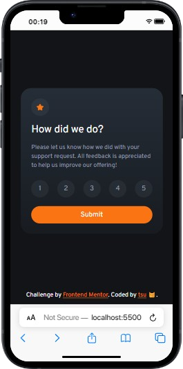
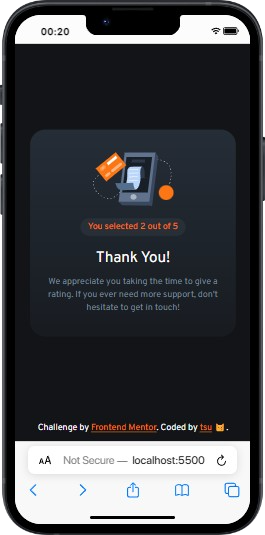
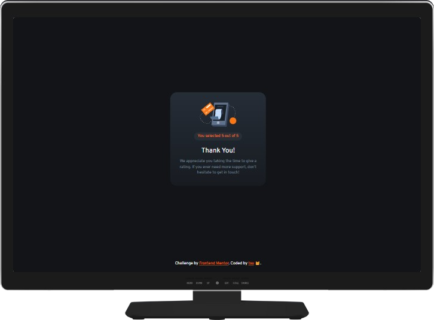

# Frontend Mentor - Interactive rating component solution

This is a solution to the [Interactive rating component challenge on Frontend Mentor](https://www.frontendmentor.io/challenges/interactive-rating-component-koxpeBUmI). Frontend Mentor challenges help you improve your coding skills by building realistic projects.

## Table of contents

- [Overview](#overview)
  - [The challenge](#the-challenge)
  - [Screenshots](#screenshots)
  - [Links](#links)
- [My process](#my-process)
  - [Built with](#built-with)
  - [What I learned](#what-i-learned)

## Overview

### The challenge

Users should be able to:

- View the optimal layout for the app depending on their device's screen size
- See hover states for all interactive elements on the page
- Select and submit a number rating
- See the "Thank you" card state after submitting a rating

## Screenshots

### Form State

<div style="display: flex; justify-content: space-between;">
    
    
</div>

### Thank You State

<div style="display: flex; justify-content: space-between;">
    
    
</div>

### Links

- Solution URL: [My Frontend Mentor Solution](https://www.frontendmentor.io/solutions/interactive-rating-component-using-tailwindcss-4osqQGqzp6)
- Live Site URL: [GitHub pages deploy](https://tsuramii.github.io/interactive-rating-component-main/)

## My process

### Built with

- Semantic HTML5 markup
- Tailwind
- Flexbox
- Mobile-first workflow
- [TailwindCSS](https://tailwindcss.com/) - CSS Framework

### What I learned

During this project, I significantly improved my skills with JavaScript Vanilla and TailwindCSS. One valuable lesson I acquired was the ability to style checked checkboxes using TailwindCSS without the need for JavaScript. Here's a code snippet that demonstrates this technique:

```html
<input type="radio" id="rating" class="peer/rating hidden" name="rating" value="1">
<label for="rating" class="peer-checked/rating:bg-lightgrey peer-checked/rating:text-white h-10 w-10 bg-mediumgrey/10 rounded-full flex justify-center items-center mt-1 hover:text-white hover:bg-orange transition-colors">1</label>
```
